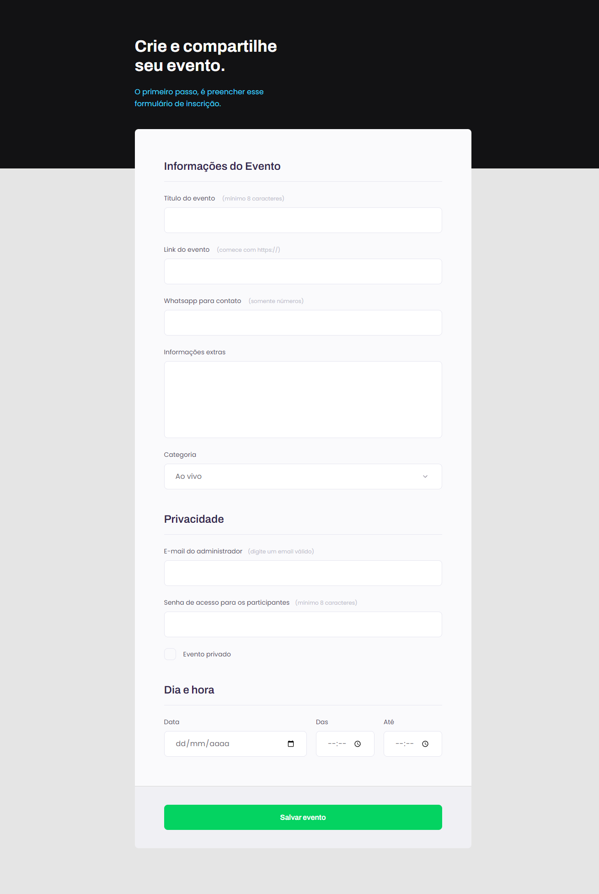

<h1 align="center">
Event Form - Crie seu Evento
</h1>

## Indexes

- [About](#about)
- [Built in](#built_in)
- [Go to](#go_to)
- [Preview](#preview)

 

## About 

This project was made in the 1st module of Explorer level 3 - Rocketseat.

In this project knowledge of forms was applied, to be made form with buttons and different types of inputs.

 

## Built in 

- HTML
- CSS

 

## Go to 

To access the site is simple, just click on the <a href = "https://event-form-tau.vercel.app">link</a>

 

## Preview 

 

